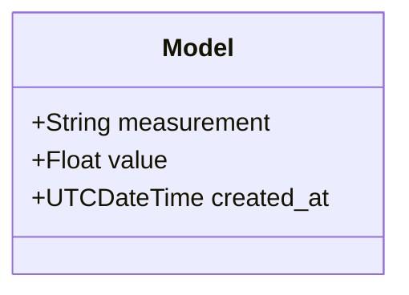
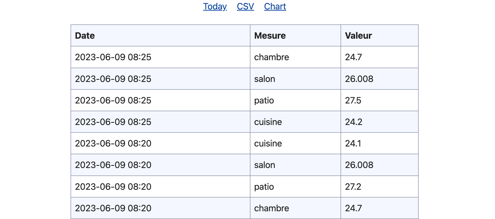
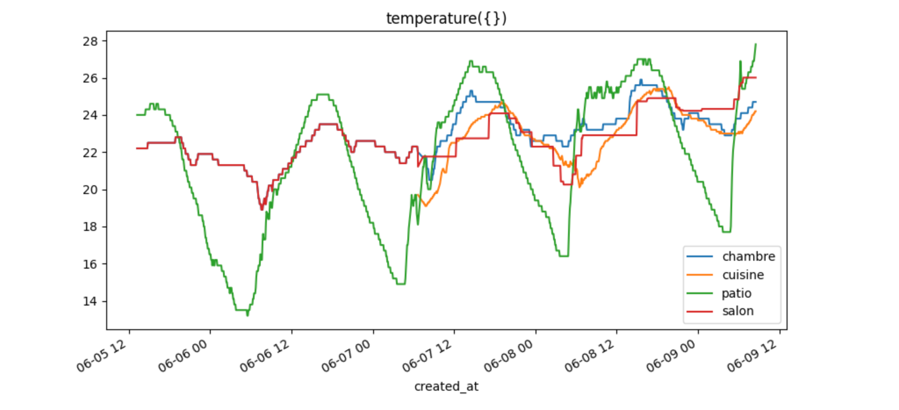

# homelog

Store, visualize and export generic metrics.

I use it as a backend for this trick [Logging HomeKit data to Google Sheets for free](https://blog.claude.nl/tech/howto/logging-homekit-data-to-google-sheets-for-free-walkthrough/), i.e. instead of Google Sheets.

## Architecture

The model is very simple and generic:



`{model}` can be any string you want and will hold any `{measurement}` you send. Each measurement line will have a `value` (float) and a record date `created_at`.

Example: I want to store temperatures measured by the various sensors in my house. Model is `temperature`, measurements are my rooms names and value is the measured temperature in this room.

## API

### POST /api/{model}/

Headers:

```
content-type: application/json
x-api-key: {env.HOMELOG_API_KEY}
```

Request (automatic `created_at`):

```json
{
    "measurement": "{my_measurement}",
    "value": {floatable_value}
}
```

Request (custom `created_at`, expected to be UTC by default):

```json
{
    "measurement": "{my_measurement}",
    "value": {floatable_value},
    "created_at": "2023-06-13T13:07:49.293213"
}
```

## Views

### HTML Table

URL: `/{model}/table`



### CSV

URL: `/{model}/csv`

### Line plot

URL: `/{model}/plot`



### Filters

Pass filters in query string like so (measurements `first` and `second` for `2023-06-09`):

`?measurement=first&measurement=second&created_at__gt=2023-06-09&created_at__lt=2023-06-10`

## Deploy to dokku

cf Procfile for specs.

Link a Postgres database to the current app.

`git push dokku main`
